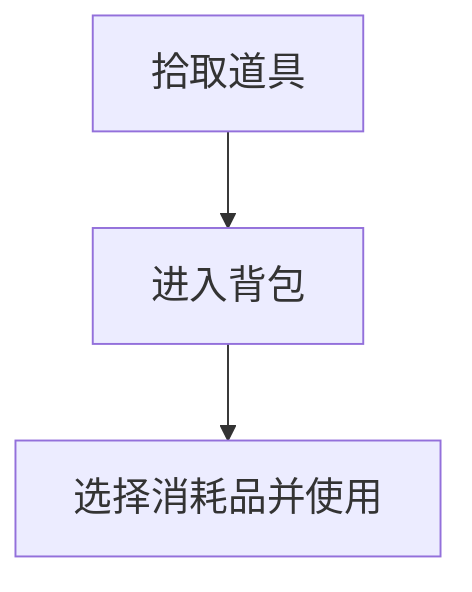

# 背包系统

## 目标
玩家拾取道具后，可在背包中使用消耗品。

## 核心流程

```mermaid
%%{init: {"themeVariables": {"fontSize": "20px"}, "flowchart": {"wrappingWidth": 300}}}%%
flowchart TD
  Pickup["拾取道具"] --> Store["进入背包"]
  Store --> Use["选择消耗品并使用"]
  click Use "#规则"
```

## 规则
| 条件 | 行为与结果 | 限制 |
| --- | --- | --- |
| 拾取道具 | 道具进入背包 | 容量与满包处理待确认 |
| 背包中存在消耗品 | 可以选择使用 | 具体效果由道具规则决定，尚待讨论 |

容量、满包处理和道具效果见 [待确认](待确认.md)。
