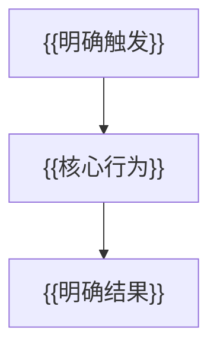

# {{系统}}

## 目标
{{玩家要达成什么，系统提供什么体验。}}

## 核心流程

```mermaid
%%{init: {"themeVariables": {"fontSize": "20px"}, "flowchart": {"wrappingWidth": 300}}}%%
flowchart TD
  Start["{{明确触发}}"] --> Action["{{核心行为}}"]
  Action --> End["{{明确结果}}"]
```

## 规则
| 条件 | 行为与结果 | 限制 |
| --- | --- | --- |
| {{已明确条件}} | {{已明确结果}} | {{已明确限制或无}} |

按需增加配置需求、跨系统关系。删除模板提示，未决内容单独放待确认.md，仅在正文链接问题。
